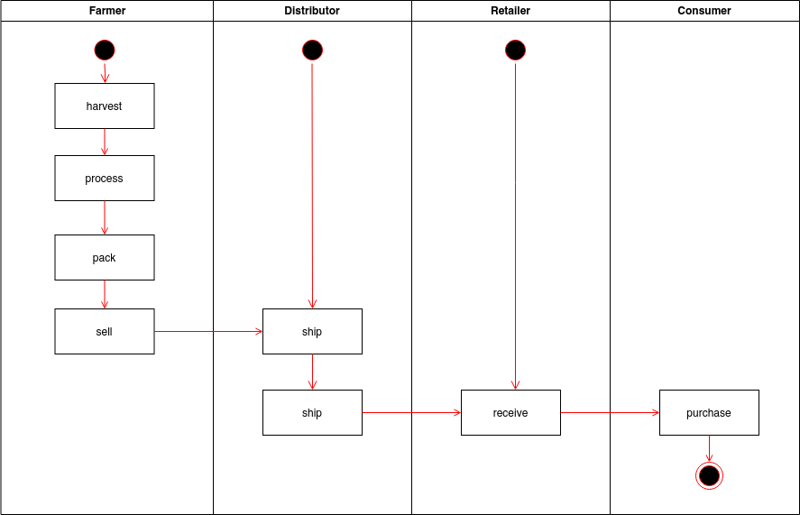
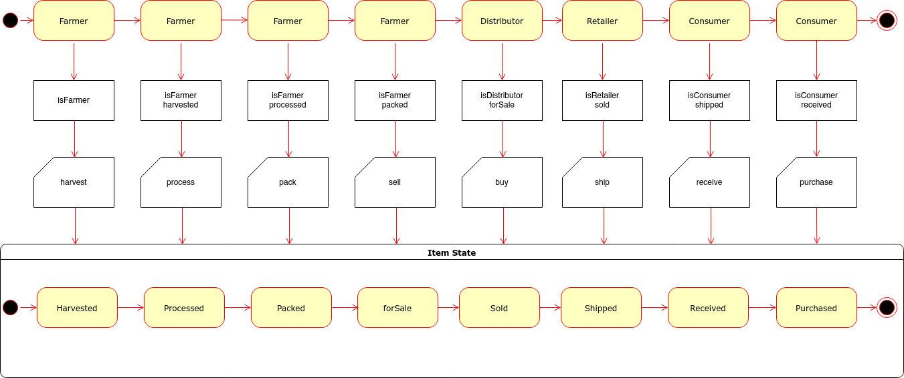
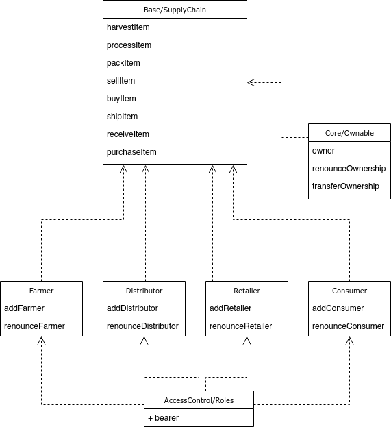

# Supply Chain Smart Contracts

Udacity Blockchain Developer Nanodegree, Project 6. Read more at: https://www.udacity.com/course/blockchain-developer-nanodegree--nd1309

## UML

### Activity

### Sequence

### State

### Class (Data Model)

## Libraries

- Truffle version: `v5.1.63`
- Truffle Wallet Prodiver: `1.0.17`

## Rinkeby Contracts

SupplyChain: 
- Transaction ID: [`0xf35311abcdea63149ac02cdbc1d8c41b5ddb24672c32f30a2d220722b0622fd6`](https://rinkeby.etherscan.io/tx/0xf35311abcdea63149ac02cdbc1d8c41b5ddb24672c32f30a2d220722b0622fd6)
- Contract Address: [`0x54bB8f4dEb72C70B8C0068e555Ce48Cc3921c02E`](https://rinkeby.etherscan.io/address/0x54bB8f4dEb72C70B8C0068e555Ce48Cc3921c02E)

FarmerRole: 
- Transaction ID: [`0xe86d9793ea4da071e2216277172873411d1354bd46f2a98897bd54f2095bef8d`](https://rinkeby.etherscan.io/tx/0xe86d9793ea4da071e2216277172873411d1354bd46f2a98897bd54f2095bef8d)
- Contract Address: [`0x11C8285FbAE05C401c6979E8B6192BEB0b38390b`](https://rinkeby.etherscan.io/address/0x11C8285FbAE05C401c6979E8B6192BEB0b38390b)

DistributorRole: 
- Transaction ID: [`0x2b93be1ee30492be89b12fb6d24b69d4a5e7c45e5189fdeacbc7c6bb1d0877f8`](https://rinkeby.etherscan.io/tx/0x2b93be1ee30492be89b12fb6d24b69d4a5e7c45e5189fdeacbc7c6bb1d0877f8)
- Contract Address: [`0xca94E5eDF4B6BA12d78452578D45929C2cBF5d66`](https://rinkeby.etherscan.io/address/0xca94E5eDF4B6BA12d78452578D45929C2cBF5d66)

RetailerRole: 
- Transaction ID: [`0xc66597bb1b955862a4046b315181560b50551b4820cb2a31dca11a63bec563cc`](https://rinkeby.etherscan.io/tx/0xc66597bb1b955862a4046b315181560b50551b4820cb2a31dca11a63bec563cc)
- Contract Address: [`0xBA889ABC469E810A02b9dD3F4B578935314e733A`](https://rinkeby.etherscan.io/address/0xBA889ABC469E810A02b9dD3F4B578935314e733A)

ConsumerRole: 
- Transaction ID: [`0x94ad97f9ee88fc56e25f192cf2326339b76c7c9541a20393707108a5928d9561`](https://rinkeby.etherscan.io/tx/0x94ad97f9ee88fc56e25f192cf2326339b76c7c9541a20393707108a5928d9561)
- Contract Address: [`0xC7f1B116606d95c518756B04bDd32972b4cE8a70`](https://rinkeby.etherscan.io/address/0xC7f1B116606d95c518756B04bDd32972b4cE8a70)

