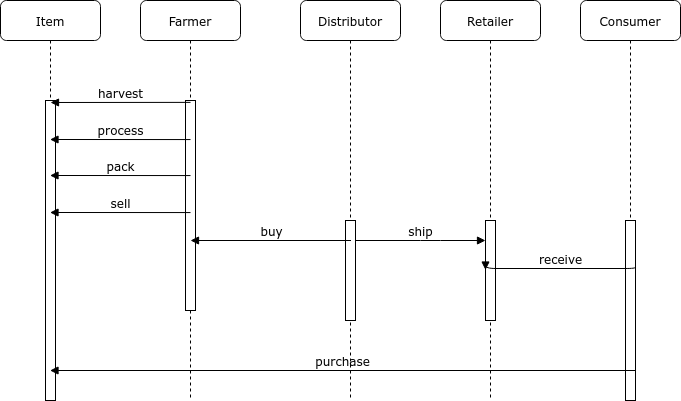

# Supply Chain Smart Contracts

Udacity Blockchain Developer Nanodegree, Project 6. Read more at: https://www.udacity.com/course/blockchain-developer-nanodegree--nd1309

## UML

### Activity

### Sequence

### State

### Class (Data Model)

## Libraries

- Truffle version: `v5.1.63`
- Truffle Wallet Prodiver: `1.0.17`

## Install

If not installed, install `truffle`:

    npm install -g truffle

Then install other packages:

    npm install

## Compile

In a terminal, start truffle console in dev mode:

    truffle dev

Then in the truffle console:

    truffle compile

## Test

In a terminal, start truffle console in dev mode:

    truffle dev

Then in the truffle console:

    test

## Run Web app with local blockchain

[Metamask](https://metamask.io/) plugin is required.

In a terminal, first start truffle in dev mode:

    truffle dev

Then, in a second terminal window, start the web server:

    npm run dev

## Deploy to Rinkeby

In a terminal, run:

    truffle migrate --network rinkeby

## Rinkeby Contract

SupplyChain:
- Transaction ID: [`0xf35311abcdea63149ac02cdbc1d8c41b5ddb24672c32f30a2d220722b0622fd6`](https://rinkeby.etherscan.io/tx/0xf35311abcdea63149ac02cdbc1d8c41b5ddb24672c32f30a2d220722b0622fd6)
- Contract Address: [`0x54bB8f4dEb72C70B8C0068e555Ce48Cc3921c02E`](https://rinkeby.etherscan.io/address/0x54bB8f4dEb72C70B8C0068e555Ce48Cc3921c02E)
